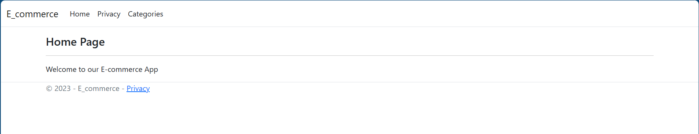
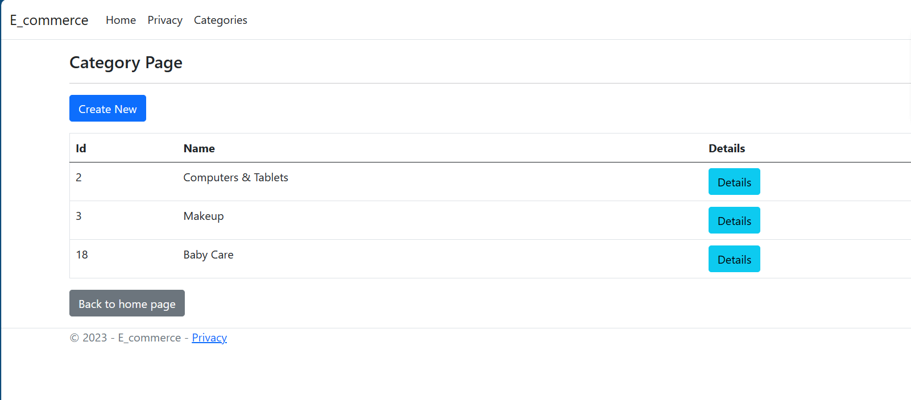
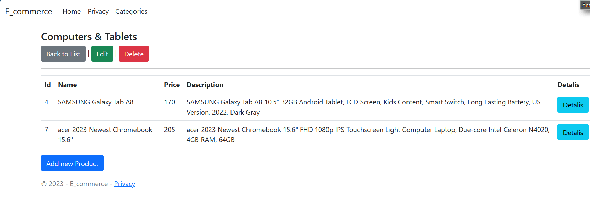


# E-commerce Admin Dashboard
-------

Welcome to the E-commerce Admin Dashboard project! This project is built using the MVC (Model-View-Controller) architectural pattern and is designed to provide an efficient workflow for managing product categories and products. Below, you'll find important information to help you get started with this project.

## Project Overview                            
-------
The main goal of this project is to create an admin dashboard for managing product categories and products. The dashboard is built using ASP.NET Core MVC framework and includes various functionalities such as creating, editing, and deleting categories and products.                                                                                    

    

## Project Structure
------
- Controllers: Contains the controller classes responsible for handling user requests and directing them to appropriate actions.

- Models: Includes the data models, properties, navigation properties, and DTOs used to represent categories and products.

- Services: Contains service classes that implement interfaces for managing categories and products.

- Views: Contains the Razor views that define the user interface for different actions. Views are organized by controller and action names.
## Testing CRUD Capabilities

Testing the CRUD (Create, Read, Update, Delete) capabilities of our controllers is a crucial step in ensuring the functionality and reliability of our application's API. These tests help us confirm that our endpoints respond correctly to various HTTP requests and that they handle data operations effectively.

- Create:

During testing, we verify that our "Create" functionality accurately adds new data to our system. This includes testing the validation of input data, handling duplicate entries, and ensuring that the created data matches our expectations.
- Read:

Testing the "Read" operations involves retrieving data from our API. We check if our endpoints return the expected data when queried and handle scenarios like filtering, pagination, and sorting.
- Update:

For "Update" operations, we confirm that our endpoints correctly modify existing data. This involves testing the ability to update specific fields, handling edge cases, and ensuring that data consistency is maintained.
- Delete:

"Delete" operations verify that our API can remove data as intended. We check that the endpoints correctly identify and delete the specified records, and that any associated data or references are appropriately managed.

## Visulazation

## Contact
If you have any questions or need assistance, feel free to contact the project contributors.

