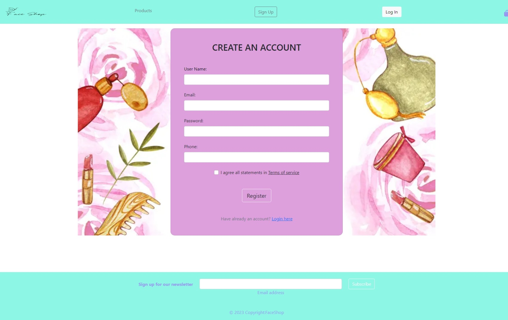
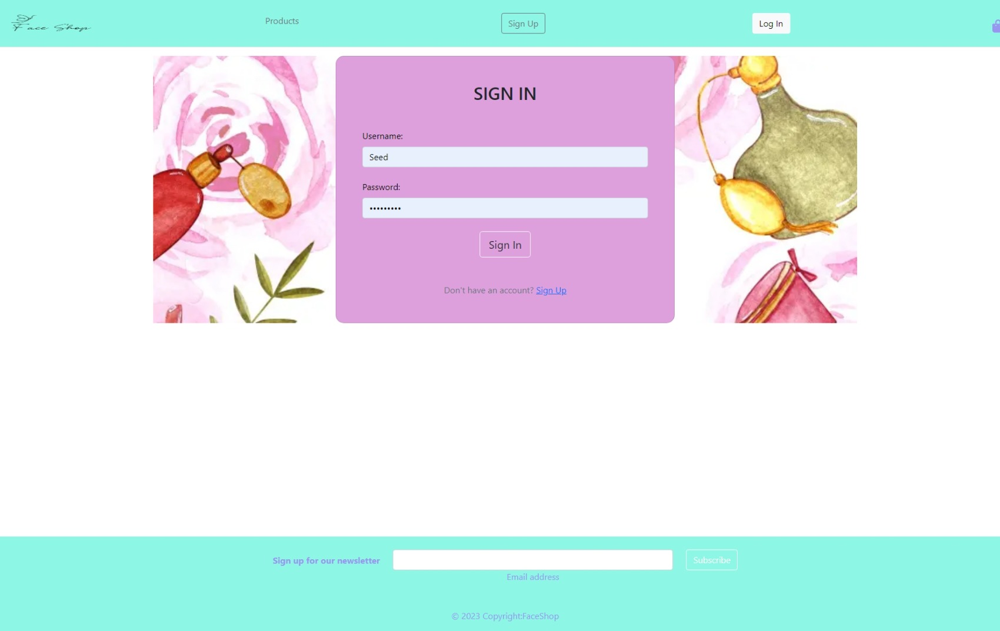
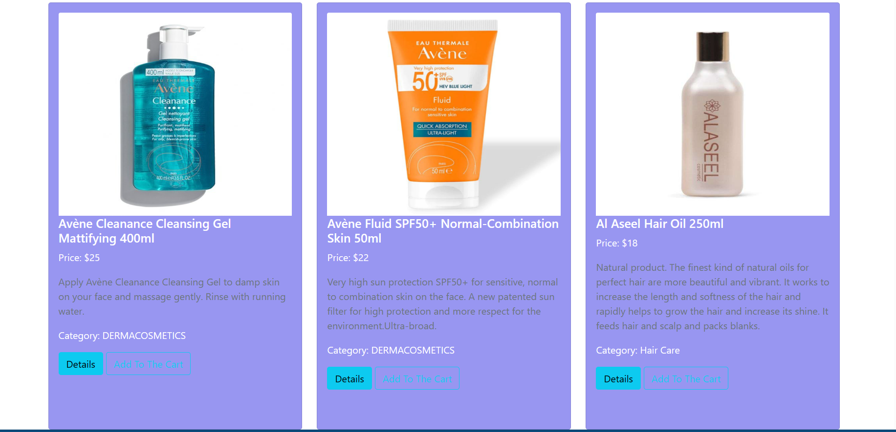
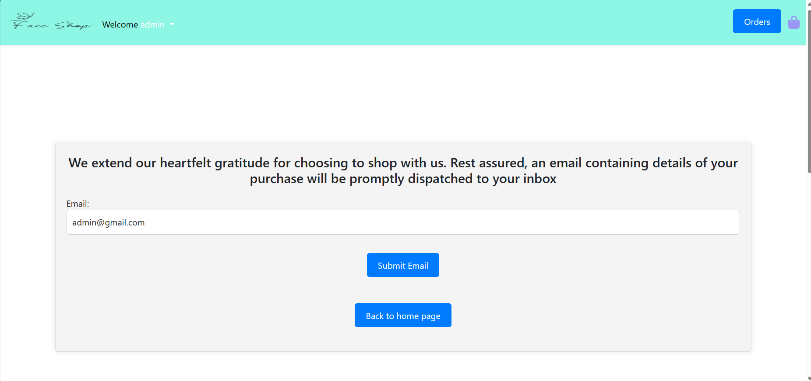
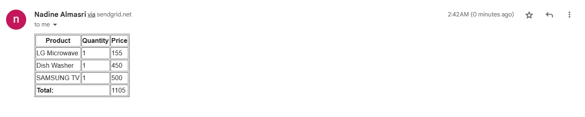
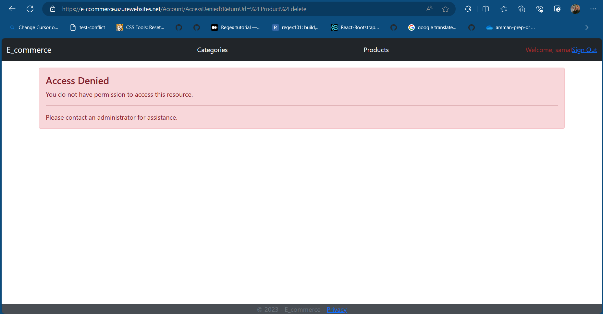
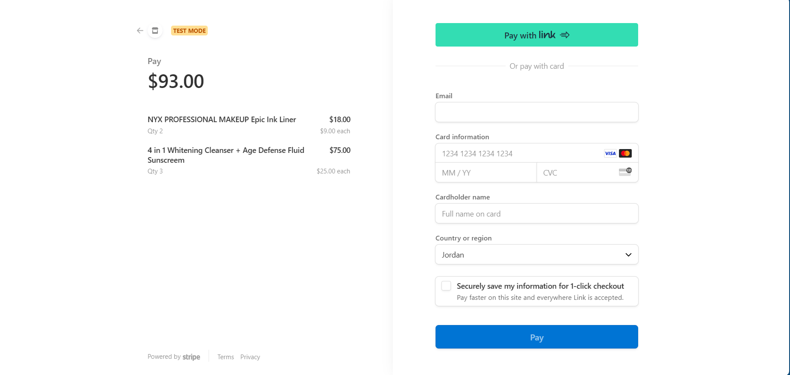
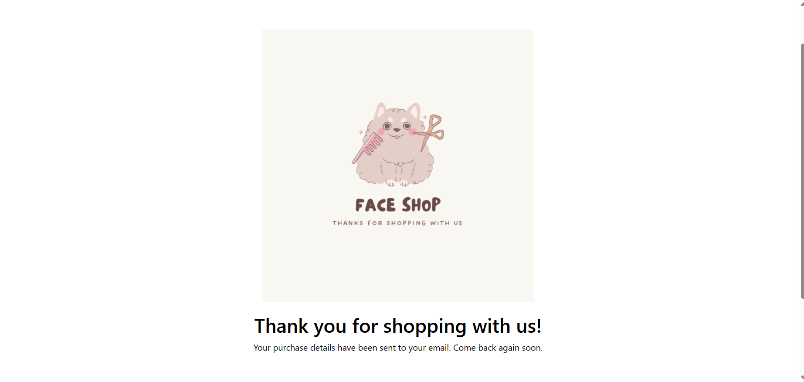

# E-commerce Web Application(Face App-Cosmatices app)

## Project Overview:
The E-commerce Web Application is a fully-featured online shopping platform designed to provide users with a seamless shopping experience. It offers a wide range of products, organized into categories, and includes user authentication, authorization, and secure payment processing.
This project is built using the MVC (Model-View-Controller) architectural pattern and is designed to provide an efficient workflow for managing product categories and products. Below, you'll find important information to help you get started with this project.

##  Introduction:
Our application is a luxurious and all-encompassing destination for beauty enthusiasts, a realm where the artistry of makeup, the science of dermacosmetics, and the elegance of perfumery converge. We invite you to embark on a journey to reveal and enhance your unique beauty in ways you've never imagined.
   ##  Key Features:

- User Authentication: Users can create accounts, log in, and securely manage their profiles.


       


- Category Catalog: A comprehensive Category catalog with  product listings.


- Product Catalog: A comprehensive product catalog with categories and detailed product listings.




- User Roles: Different user roles, including administrators, editors, and regular users, with varying levels of access and permissions.
- Responsive Design: The application is responsive and accessible across various devices.
- Email Notifications: Users receive email notifications after confirming orders and registering. Email notifications can include order confirmations and welcome messages.


- Payment Processing with Stripe: Secure and convenient payment processing through the Stripe payment gateway, allowing users to make payments for their orders.
## Technology Stack:

- ASP.NET Core for the backend
- Entity Framework Core for database management
- Microsoft SQL Server for data storage
- Razor Pages and Views for the frontend
- Bootstrap for responsive design
- Azure for cloud hosting and database services
- Payment Processing:

Stripe (for secure payment processing)
- Email Notifications:

SendGrid (for sending email notifications)


## Authentication and Authorization:
Users can create accounts and log in, and different roles (e.g., administrators, editors) are assigned specific permissions to manage the application.

## Policies and Security:
The application enforces security policies to protect user data and maintain data integrity. User data is securely stored and transmitted.

## Deployment and Hosting:
The project is hosted on Azure, ensuring high availability and scalability.
## Challenges Faced:
Challenges during development included database setup, role-based authorization, and integrating secure payment processing.
## Vulnerability Report:
- Authentication and Authorization Implementation
For enhanced user experience, we have introduced a custom "Access Denied" page. If a user attempts to access a restricted area or functionality without the necessary permissions, they are redirected to this page. This feature not only strengthens security but also provides a clear message to the user about the denial of access.
so if user try to acces data using the routes or path it will redirect him to the acces denied page , we found that for some button that we cosumes to only appear for the admin like " create new product " the user can access it by the route of it , and now we are able to deal with that.


In this project, we prioritize the security and protection of sensitive information. To achieve this, we have implemented a robust system of authentication and authorization.
## Project Structure

- Controllers: Contains the controller classes responsible for handling user requests and directing them to appropriate actions.

- Models: Includes the data models, properties, navigation properties, and DTOs used to represent categories and products.

- Services: Contains service classes that implement interfaces for managing categories and products.

- Views: Contains the Razor views that define the user interface for different actions. Views are organized by controller and action names.
## Database Schema:
The database includes tables for Categories, Products, Users, Roles, and UserRoles, among others. These tables are interconnected to manage product data and user authentication efficiently.
### Introduction
The database schema for our application is designed to support the functionality of our e-commerce store. It includes tables for managing products, categories, shopping baskets, orders, and user information. The schema is built on Microsoft SQL Server and hosted on Azure and on deployment we use Azure SQL databases
.

### Schema Overview
Our database schema consists of the following tables:


- Categories: Stores information about product categories.
- Products: Contains details about individual products, including name, price, description, and category.
- Users: Captures user information, including usernames, email addresses, and roles.
- Cart
- CartProduct
- orders

### Explanation of DB Schema
1. Categories and Products:


     * The Categories table allows us to categorize products, making it easier for users to browse and search for items.

     * The Products table stores detailed information about each product, such as name, price, description, and category. This enables users to view product details and make informed purchase decisions.

2. Users

      - The Users table captures user data, including usernames, email addresses, and roles. Roles help us enforce security policies and control access to certain parts of the application.


## Claims
In our application, we capture the following claims:

- Username: We capture the username of authenticated users to provide a personalized shopping experience.

- Email Address: We capture the email address of users for communication purposes, such as order confirmations and notifications.

- Role: We assign roles (e.g., Administrator, Editor, User) to users to enforce access control policies. Each role has specific permissions within the application.

## Policies
We enforce the following policies in our application:

- Authentication Policy:

All users must authenticate using their username and password or other authentication methods supported by our Identity system.

- Authorization Policy: 
 
Different roles (Administrator, Editor, User) have varying levels of access to application features and data. For example, only Administrators can manage product categories and user roles.

- Category and Product Policy:

Only Administrators and Editors can create, edit, or delete categories and products. Regular users can view and purchase products.
if any user try to access one of these using the path of it it will show him a page represent "access deined" as it shown below :




By defining these policies, we ensure data security, access control, and a smooth user experience within our e-commerce application.

## Roles :
1. Administrator:

- AuthController: Administrators can sign up, log in, and log out like regular users. However, their primary role is to manage other aspects of the application.
- CategoryController: Administrators have full control over categories. They can view, create, edit, and delete categories. This role is responsible for maintaining the category structure of the store.
- ProductController: Administrators can perform all actions related to products. They can view the product list, view product details, create new products, edit existing products, and delete products. This role is responsible for managing the product catalog.
- HomeController: Administrators have access to general pages like the home page, privacy policy, and error pages.
2. Editor:

- AuthController: Editors can sign up, log in, and log out like regular users.
- CategoryController: Editors can view categories, but their primary role is to edit existing categories. They can make changes to category names.
- ProductController: Editors have similar permissions to administrators but with limitations. They can view products, view product details, edit existing products, and create new products. However, they cannot delete products.
- HomeController: Editors have access to general pages.
3. User:

- AuthController: Users can sign up, log in, and log out.
- CategoryController: Users can view categories but cannot make any changes.
- ProductController: Users can browse the product catalog, view product details, and purchase products. They cannot create, edit, or delete products.
- HomeController: Users have access to general pages.


These role-based permissions ensure that each user type has a specific set of actions they can perform within the application, providing a secure and controlled environment for managing your e-commerce platform.
## Payment Method Integration

### Stripe Integration

We have integrated the Stripe payment gateway to facilitate secure and seamless online payments for our users. Stripe is a widely-used platform that ensures the security of payment transactions. Here's how the integration works:



1. **Configuration**: To set up Stripe, you will need to obtain API keys from the Stripe dashboard. Update the configuration file (`appsettings.json`) with your Stripe API keys.

   ```json
   {
       "StripeSettings": {
           "PublicKey": "your_public_key",
           "SecretKey": "your_secret_key"
       }
   }

  2. Checkout Process: Users can add products to their shopping cart and proceed to checkout. During the checkout process, Stripe handles the payment processing securely.

3. Payment Confirmation: After a successful payment, users are redirected to an order confirmation page. The payment status is checked, and if the payment is confirmed, an email receipt is sent to the user.

## User Registration Email
### Welcoming New Users
We provide a welcoming email to all new users who register on our platform. This email includes important information about their registration and how to get started with our e-commerce website. Here's how it works:

- Registration: When a user successfully registers on our platform, they receive a welcoming email to the provided email address.

- Email Content: The welcoming email contains a warm greeting, an introduction to our platform, and steps to get started, such as browsing products, adding items to the cart, and making a purchase.

- Customization: You can customize the welcoming email content and design to match your branding and provide a personalized experience for new users.
## Order Confirmation Email

### Email with Order Details
After a user successfully completes a payment and the order is confirmed, we send an email with detailed order information. This email serves as a receipt and includes:

- A list of the purchased products, including their names, quantities, and prices.
- The total amount paid for the order.
- Shipping and delivery details.

and it will display a thanking message after finishing payment 

## Getting Started
To run this project locally or deploy it to a server, follow the steps outlined in our installation and deployment documentation.

For more details about the project, including setup instructions, usage, and additional features, refer to our complete documentation.

## Support and Feedback
If you encounter any issues, have questions, or want to provide feedback, please don't hesitate to contact our support team or create an issue in our GitHub repository.

Thank you for choosing our E-commerce website! We hope you enjoy using it.

## Project Deployment Link:

You can access the deployed version of this project by clicking  here [E-commerce](https://e-ccommerce.azurewebsites.net/)