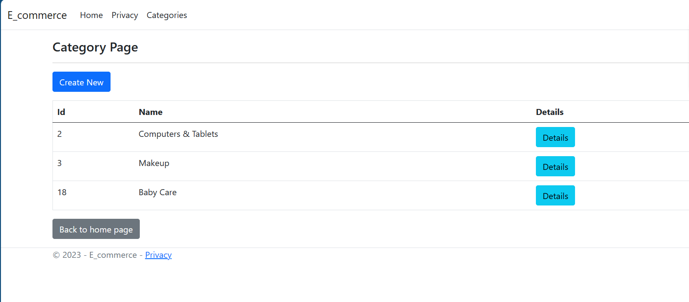
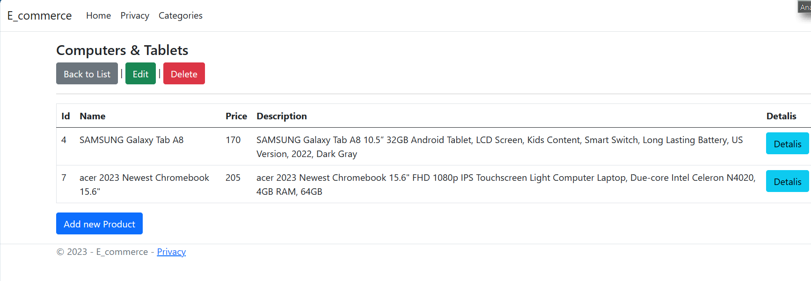

# E-commerce Admin Dashboard
-------

Welcome to the E-commerce Admin Dashboard project! This project is built using the MVC (Model-View-Controller) architectural pattern and is designed to provide an efficient workflow for managing product categories and products. Below, you'll find important information to help you get started with this project.

## Project Overview                            
-------
The main goal of this project is to create an admin dashboard for managing product categories and products. The dashboard is built using ASP.NET Core MVC framework and includes various functionalities such as creating, editing, and deleting categories and products.                                                                                    

    

## Project Structure
------
- Controllers: Contains the controller classes responsible for handling user requests and directing them to appropriate actions.

- Models: Includes the data models, properties, navigation properties, and DTOs used to represent categories and products.

- Services: Contains service classes that implement interfaces for managing categories and products.

- Views: Contains the Razor views that define the user interface for different actions. Views are organized by controller and action names.

## Visulazation

## Contact
If you have any questions or need assistance, feel free to contact the project contributors.

